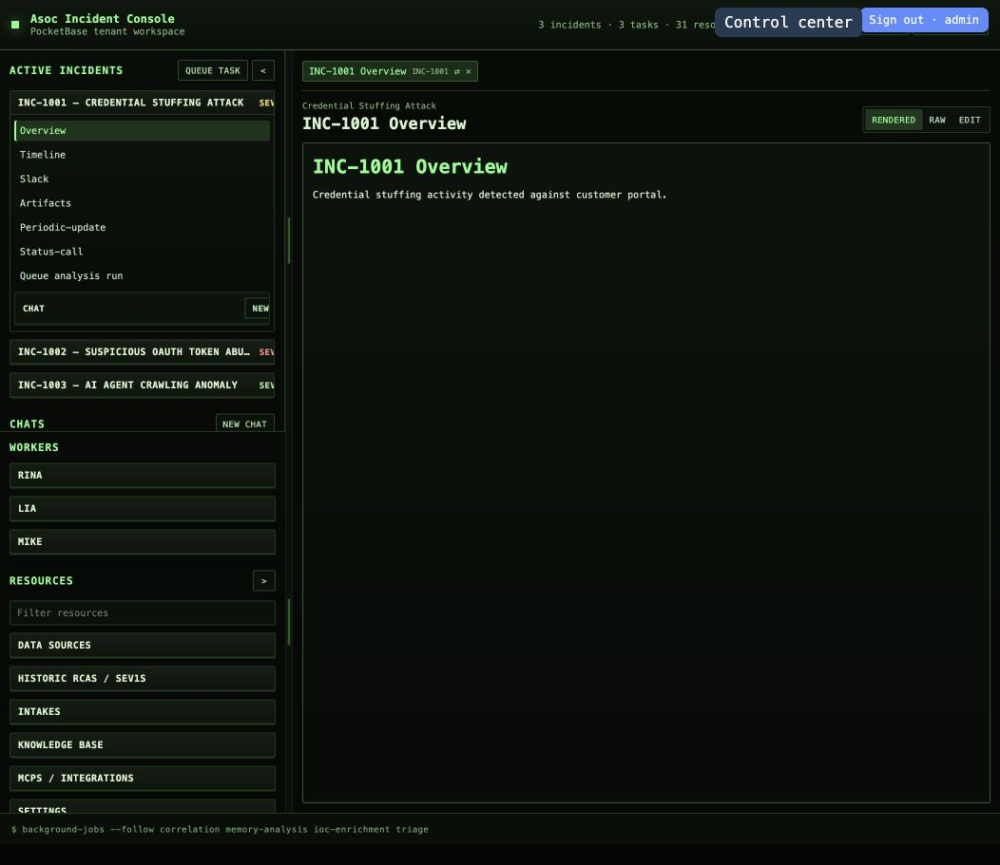
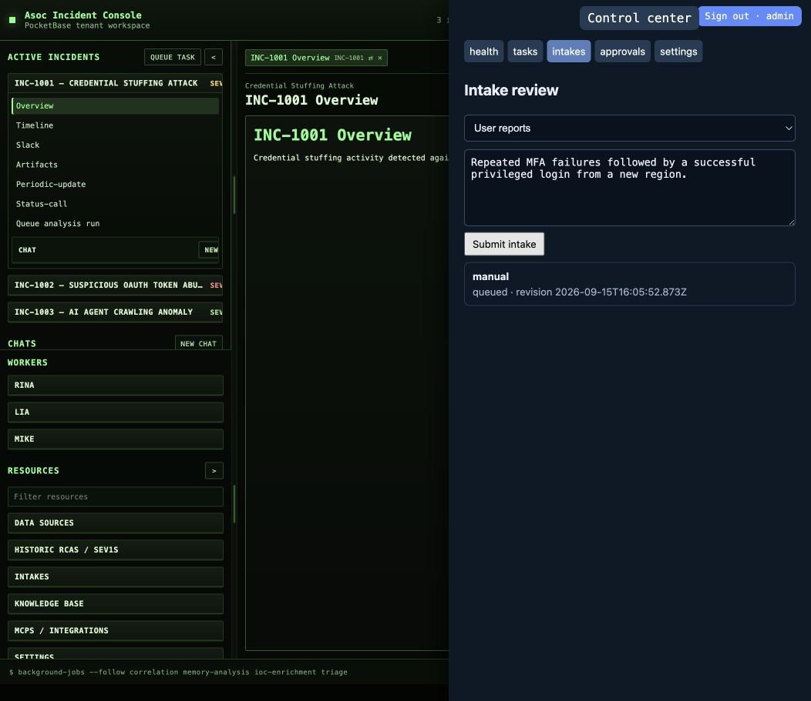
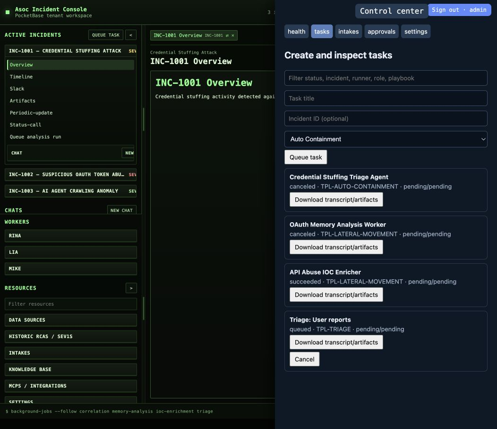
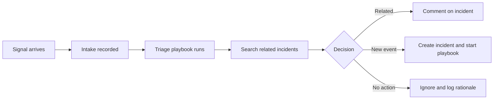

# Asoc

Asoc is an agent-assisted workspace for security operations. It brings incidents, incoming signals, investigation context, response playbooks, and background agent work into one place so analysts can move from detection to a documented decision without losing context between tools.

The workspace is designed for security teams that want automation to help with triage and analysis while keeping people in control of consequential actions.

## What Asoc helps you do

- Review active incidents and their chat, overview, timeline, evidence, and collaboration history.
- Receive reports, alerts, GitHub pull requests, Jira issues, and scheduled hunts through configurable intake channels.
- Triage new signals against existing incidents before creating duplicate work.
- Run investigation and response playbooks as durable background tasks.
- Follow model output as it streams and retain the transcript, evidence, decisions, and generated artifacts.
- Control every MCP tool at the playbook level with `deny`, `allow`, or `require approval`.
- Keep reusable knowledge, data-source guides, past incident reviews, skills, and integrations close to the investigation.

## The core concepts

### Incidents

An incident is the shared operational record for a security event. It contains several views of the same investigation: discussion, current assessment, timeline, artifacts, and external collaboration. Opening these views as tabs lets an analyst compare evidence without leaving the incident.

### Intakes

An intake is an incoming item that may require action. It can come from an analyst, an alert webhook, a schedule, a GitHub pull request, or a Jira issue. Each intake keeps its source identity and revision so delivery retries do not create repeated work.

### Triage playbooks

Every intake is assigned a triage playbook. The playbook tells the triage agent what evidence to inspect, how to look for related incidents, and which tools it may use. Triage ends with one recorded decision:

1. Add the new evidence to an existing incident.
2. Create an incident, select a response playbook, and start it.
3. Ignore the intake and retain the reason.

This separates transport deduplication from the judgment of whether two signals describe the same incident.

### Tasks and runners

A task is a durable unit of agent work. It records the selected playbook, model, state, transcript, tool requests, and artifacts. Independent runners claim queued tasks, stream progress back to the workspace, and recover work safely after interruption.

### Playbooks and tools

Playbooks define the job, required context, expected outputs, model settings, timeout, and available MCP tools. Each tool receives one of three policies:

| Policy | Behavior |
| --- | --- |
| `deny` | The agent cannot see or invoke the tool. This is also the default for unspecified tools. |
| `allow` | The agent may invoke the tool during the task. |
| `require approval` | The exact tool call and arguments pause for an admin or analyst to review. Approval applies only to the current task or session. |

### Resources

Resources provide the operational memory around an incident: response playbooks, knowledge articles, historic RCAs, skills, data-source notes, and MCP integration definitions. Analysts can open them beside live incident material and agent output.

## Typical workflows

### Triage a new signal

The intake delivery is idempotent, while the triage agent makes the incident-level correlation decision from evidence defined by its playbook.

### Investigate an active incident

1. Open the incident from the left navigation.
2. Review its overview and timeline alongside relevant evidence.
3. Ask questions in the incident chat or start a specific analysis playbook.
4. Follow the background task as the runner streams progress.
5. Review any requested MCP action and approve or deny it for that task.
6. Use the stored transcript, tool results, and artifacts to update the incident.

### Review a pull request or Jira issue

Selected GitHub repositories and Jira Cloud projects can feed their changes into an intake playbook. The same triage path checks for related incidents, records its decision, and starts follow-up work when needed. Output actions such as creating or updating Jira records are declared by the playbook and constrained by its allowed MCP tools.

## Workspace tour

The application uses three connected areas:

- **Left:** active incidents and background tasks.
- **Center:** a tabbed workspace for incident views, resources, conversations, and task output.
- **Right:** playbooks, knowledge, previous incident reviews, skills, data sources, integrations, and intakes.

The Control Center provides task creation and filtering, intake review, approval requests, runtime health, model defaults, integrations, playbooks, and user administration. Roles are `admin`, `analyst`, and `read-only`.

## Current status

The current v0.1 implementation includes the PocketBase-backed workspace, durable tasks and chat, real Gemini execution, OpenAI-compatible and Ollama adapters, intake deduplication, GitHub and Jira intake handlers, and playbook-level MCP approval enforcement.

Some integrations still require deployment credentials and end-to-end acceptance. The current checklist is maintained in [TODO.md](TODO.md).

## Try it locally

The application starts with an invite-only local account. The initial login is `admin` / `password` and requires an immediate password change.

For installation, runner configuration, containers, secrets, migrations, and development commands, see the [technical reference](TECHNICAL.md) and the [PocketBase implementation guide](pocketbase-v1/README.md).

The earlier static workspace concept remains available at `interface-example.html` and can be served directly for a read-only product tour.

## Documentation

- [Technical reference](TECHNICAL.md) — repository layout, local setup, secrets, architecture, and the original interface specification.
- [PocketBase implementation guide](pocketbase-v1/README.md) — the active application stack and operational commands.
- [System specification](pocketbase-v1/SPECS.md) — backend collections, contracts, roles, and runtime behavior.
- [Deployment guide](pocketbase-v1/DEPLOYMENT.md) — container and tenant deployment notes.
- [Roadmap and release acceptance](TODO.md) — implementation status and remaining end-to-end checks.

## License

Asoc is source-available under the PolyForm Internal Use License 1.0.0. Organizations may use and modify it for their own internal operations. See [LICENSE.md](LICENSE.md) for the binding terms and [LICENSE-CLARIFICATION.md](LICENSE-CLARIFICATION.md) for a plain-language summary.
